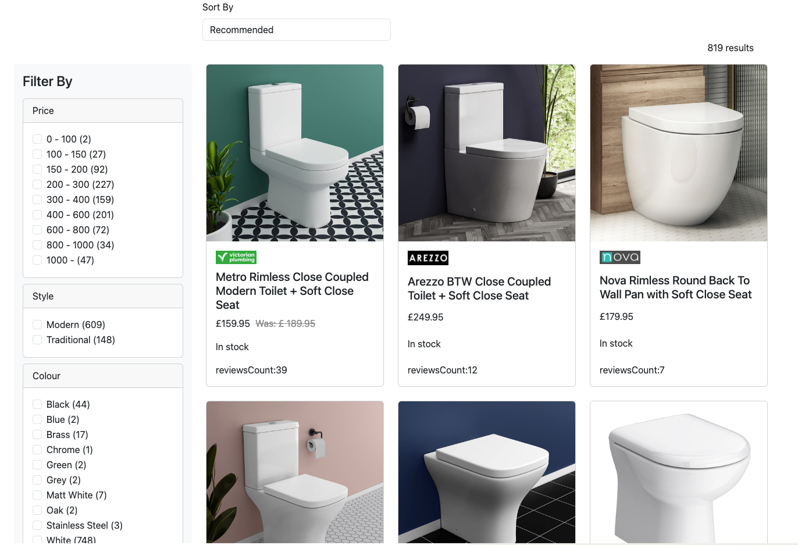

## E-commerce Listing Page

This page allows users to search and filter products based on various criteria. It is built using React and Bootstrap for the frontend, and it interacts with an API to fetch product data.

## View

## Features

- **Sorting Options**: Products can be sorted by recommended, price low to high, price high to low, and largest discount.
- **Filter by Facets**: Users can filter products using various facets such as price, brand, and other attributes.
- **Pagination**: Load more products with a "Load More" button to handle large datasets.

## Design Structure

- **Components**:
  - `ProductGrid`: Main component that manages product data, sorting, and filtering.
  - `ProductCard`: Displays individual product details.
  - `Filter`: Manages and displays filter options.
- **State Management**: Utilizes React's `useState` and `useEffect` hooks to manage application state and side effects.
- **Styling**: Uses Bootstrap for responsive design and layout.

## Functionalities

- **Filtering** :Filters update the product list dynamically as users check.
- **API Integration** : Fetches product data from an external API based on query, sorting, and selected filters.
- **Responsive Design** : Ensures the application is usable on various screen sizes.

## Improvement

- **Enhanced Error Handling**: Implement more robust error handling and user feedback for network issues.
- **Testing**: Add unit and integration tests to ensure the reliability of the application.
- **Accessibility**: Enhance accessibility features to make the application usable for all users.
- **Loading Indicators**: Displays loading indicators while fetching data from the API.
- **Dynamic Filtering** : Make filters update the product list if users uncheck.
- **Use global style CSS** : Implement a global CSS style to maintain consistency across the application.
